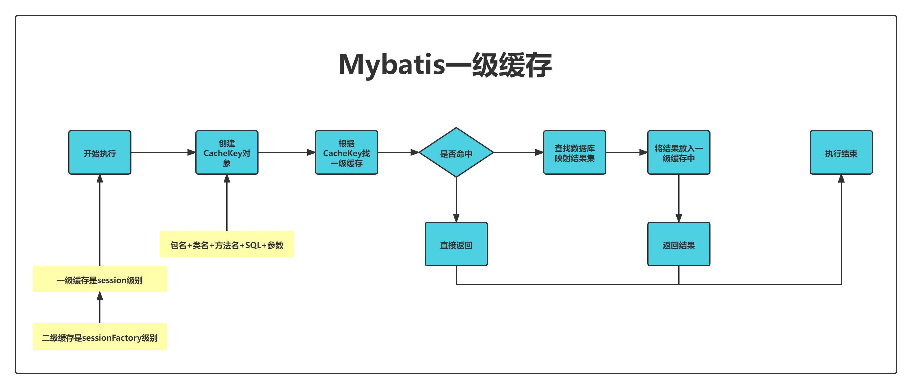

### 缓存相关模块  
1.  一级缓存是`Session`级别的【SQL查询结果就是可以利用一级缓存的】  
2. 二级缓存是`SessionFactory`级别的,二级缓存是可以被多个缓存共享的。【executor执行器就是可以利用二级缓存的】    
3. 缓存和会话(`SqlSession`绑定)，会话消失，缓存也就清空了  
4. 会话消失之前，同一个接口，同样的参数，只查询一次，其他的从缓存中去取  
5. 在缓存这个模块，利用了一个装饰者模式  
6. 默认使用的缓存是 `PerpetualCache`  
7. 缓存的配置在mapper.xml中  

```
<cache
  type="PerpetualCache.Class"
  eviction="FIFO"
  flushInterval="60000"
  size="512"
  readOnly="true"/>
<!-- 还可以指定自定义缓存 -->
<cache-ref namespace="com.someone.application.data.SomeMapper"/>


<!-- 在对应的SQL语句上，标识是否需要使用缓存 -->
<select ... flushCache="false" useCache="true"/>
<insert ... flushCache="true"/>
<update ... flushCache="true"/>
<delete ... flushCache="true"/>
```

8. 是否开启全局性的二级缓存，在mybatis-config.xml中设置
```xml
<settings>
    <setting name="cacheEnabled" value="true"/>
</settings>
```


9. `PerpetualCache` 永久缓存。就是利用一个`HashMap`
10. `BlockingCache` 阻塞缓存。保证在同一时间，对于同一个key，只有一个线程能去缓存中查找。维护了一个锁集合
```
// 每个key都维护了一个CountDownLatch
private final ConcurrentHashMap<Object, CountDownLatch> locks;
```

11. `LruCache` 最近最少使用缓存。是一种缓存淘汰机制。当内存空间满后，淘汰最近最少使用
12. `LruCache`基于 LinkedHashMap 覆盖其 removeEldestEntry 方法实现。维护一个map，记录key的最近使用情况
```
  // 有序的hashmap，用于记录key最近的使用情况
  private Map<Object, Object> keyMap;
```


13. `FifoCache` 先进先出缓存。是一种缓存淘汰机制。维护了一个key的Deque队列 
```
// 用于记录key进入缓存的先后顺序
private final Deque<Object> keyList;
```

14. `SoftCache` 软引用缓存，核心是SoftReference
15. `WeakCache` 弱引用缓存，可以看到代码和SoftCache如出一辙，就是SoftReference变成了WeakReference
  
  